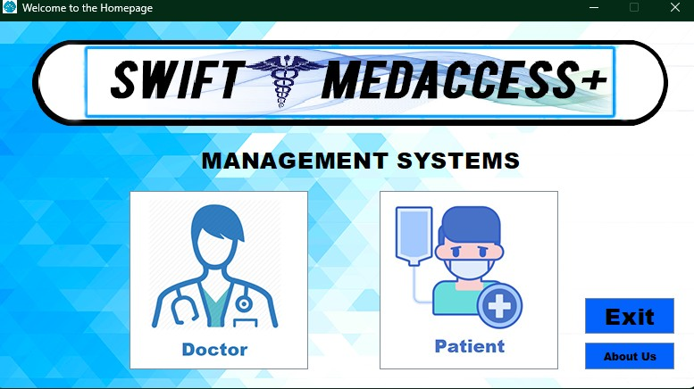
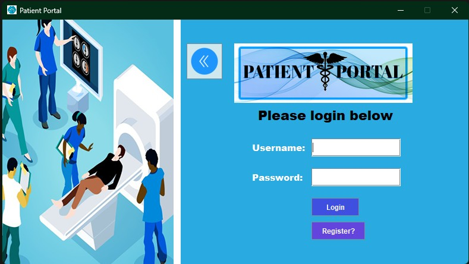
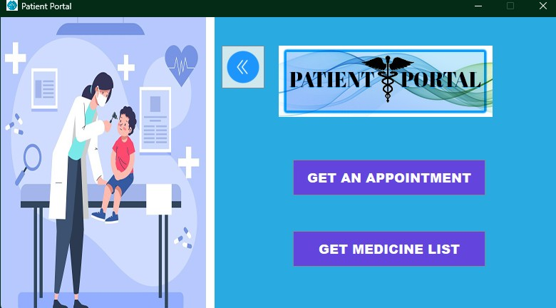
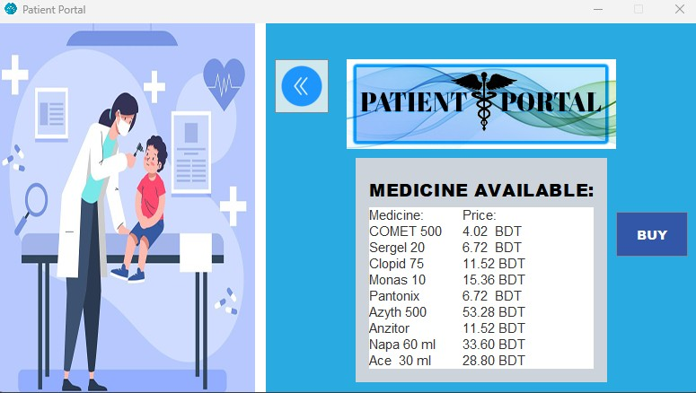
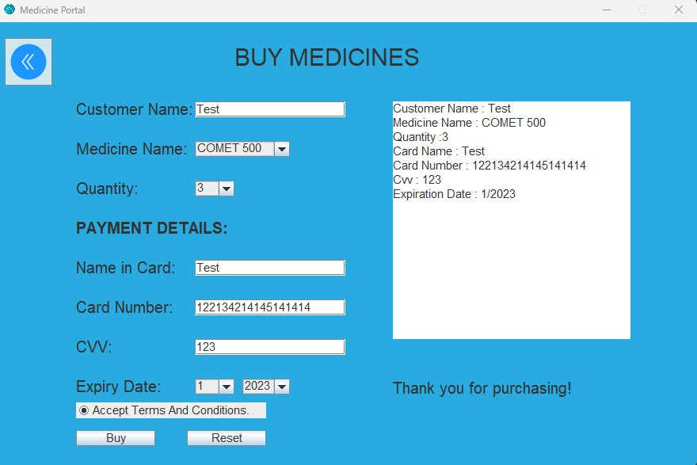

<p align="center">
  
</p>

# Swift MedAccess — Clinic Management App

A Java Swing desktop app for a small clinic management system. Built as a 2nd-semester university project at AIUB.

Patients can register, log in, view available doctors, and buy medicines. Doctors can register, log in, see the registered patient list, and view the medicine inventory. Accounts and lists persist to flat text files under `Data/`.

## Screenshots

<table>
  <tr>
    <td align="center"><strong>Login</strong></td>
    <td align="center"><strong>Patient Portal</strong></td>
  </tr>
  <tr>
    <td></td>
    <td></td>
  </tr>
  <tr>
    <td align="center"><strong>Medicine List</strong></td>
    <td align="center"><strong>Buy Medicines</strong></td>
  </tr>
  <tr>
    <td></td>
    <td></td>
  </tr>
</table>

## Screens

- **Homepage** — entry point with Doctor / Patient / About Us / Exit
- **Doctor portal** — login, registration, patient list, medicine list
- **Patient portal** — login, registration, available doctors, buy medicine

## Project structure

```
.
├── Start.java          # main entry point
├── Homepage/           # Homepage, About Us
├── Doctor/             # Doctor pages, registration, account, portal
├── Patient/            # Patient pages, registration, account, portal, buy medicine
├── Data/               # flat text files (accounts, doctor list, patient list, medicines)
├── imgs/               # UI assets (logo, backgrounds, icons)
└── screenshots/        # screenshots used in this README
```

## Requirements

- JDK 8 or newer (developed against JDK 21)

## Build and run

From the project root:

```bash
javac Start.java Homepage/*.java Doctor/*.java Patient/*.java
java Start
```

Run it from the project root so the relative paths to `Data/` and `imgs/` resolve.

## Sample logins

Some sample accounts already exist in `Data/data.txt` (patients) and `Data/data2.txt` (doctors). You can also register new accounts from the UI.

## Caveats

This was a learning project, not production code.

## License

See [LICENSE](LICENSE).
